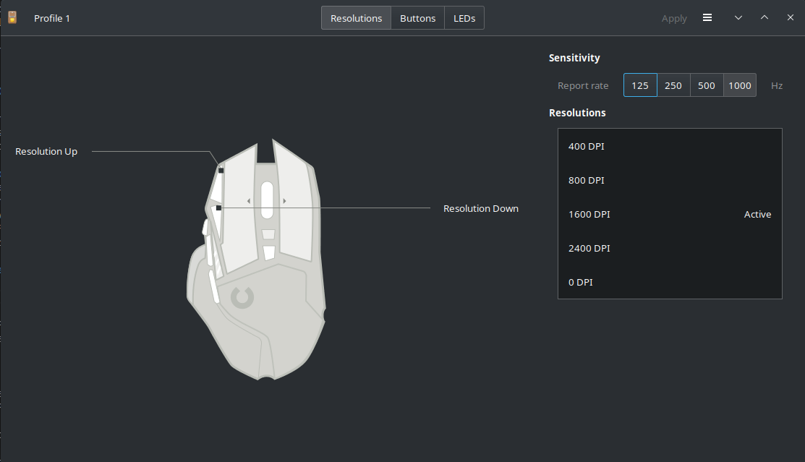
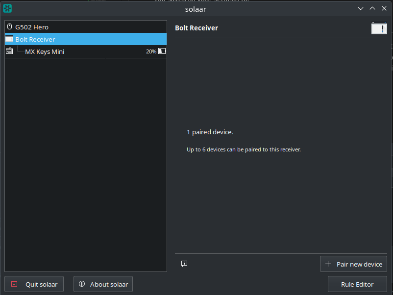
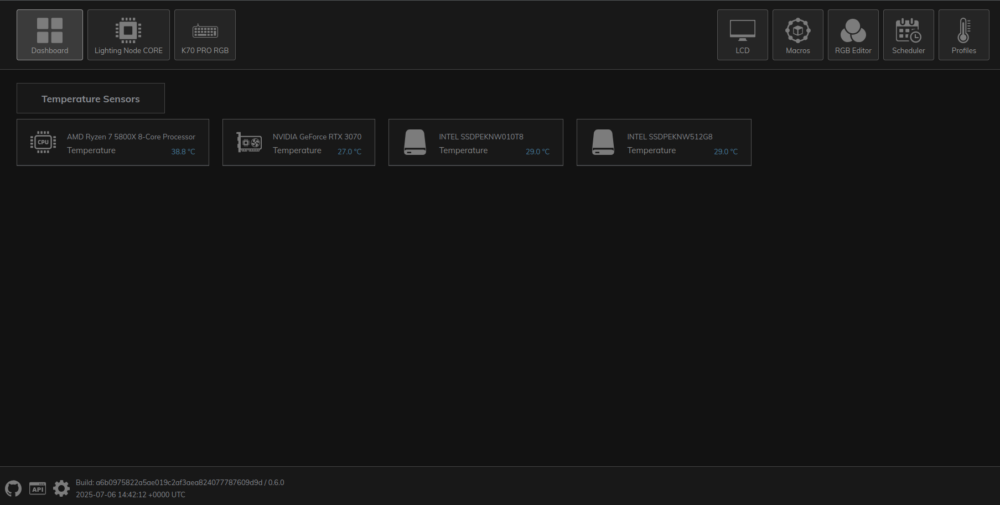

# Windows To Linux
## Percentage Chance of Permenant Move To Linux

31 Jul 2025 - 100%

## Current State - Testing

| Item | Type | Status | Workaround |
|------|------|--------| ---------- |
| Heros Of the Storm | Game | Passed | N/A |
| Factorio | Game | Passed | N/A |
| Satisfactory | Game | Passed | N/A |
| Deep Rock Galactic Survivor | Game | Passed | N/A |
| Deadzone Rogue | Game | Passed | N/A |
| Deep Rock Galactic| Game | Passed | N/A |
| Starship Troopers: Extermination | Game | Partial | - |
| RTX 3070 | Drivers | Passed | Not installed from Nvidia |
| Steam | App | Passed | N/A |
| Battle.net | App | Passed | N/A |
| OpenRGB | App | Partial | N/A |
| Jetbrains Toolbox | App | Passed | N/A |
| Rider | App / IDE | Passed | N/A |
| Visual Studio Code | App | Passed | N/A |
| OpenLinkHub | App | Passed | N/A |
| Rider | App | Testing | N/A |
| Slack | App | Passed | N/A |
| FL Studio | DAW | TODO | - |
| Ableton 11 | DAW | TODO | - |
| K70 RGB Pro V2 | Hardware RGB | Fail | Yes |
| Asus / Corsair Fans | Hardware Control | Pass | Yes |
| Xbox One Wired Controller | Hardware | Pass | N/A |
| G502 Hero Button Customisation | Hardware | Pass | N/A |

### Testing Key

| Status | Meaning |
| ------ | ------- |
| Passed | Works on Linux, no workaround needed |
| Testing | Establishing if it works or a workaround can be used |
| Fail | Does not work / cannot be controlled through Linux |
| Fail - With workaround | Workaround found |
| Partial | Most parts of this work with a couple of exceptions |
| TODO | It is on the list of things to test |

## Current Applications / Software

| Application | Purpose | Location |
| ----------- | ------- | --------- |
| OpenRGB | Lighting hardware control for fans, motherboard etc | |
| Lutris | Games outside Steam (Battle.net etc) | |
| Steam | It's steam...| |
| Piper | Logitech 502 Hero configuration | |


## Overview

I have made the decision to not upgrade to Windows 11 (for my own reasons) and will be left with few options. I want to document all the things that I am doing to migrate over to Linux with any potential gotchas, hardware issues and workarounds so that someone else may benefit from this. I will do my best to document as I go but a few things may get lost.

## Notable Differences Between Linux And Windows
- Machine boots faster
- Runs cooler
- Less memory consumed
- Games experience, in a lot of cases, better FPS than Windows (not in all instances)
- Steam games that "run on Linux" filter does not exclude any games in my library

## Use Case
On my main machine I use it for light MS Office bits, development, gaming and music production.

## Hardware

|Type|Manufacturer| Model |
|----|------------|-------|
| CPU | AMD| Ryzen 5800 X |
| Motherboard | Asus | B550-F Gaming |
| GPU | Nvidia | RTX 3070 |
| Keyboard | Corsair | K70 RGB PRO V2 |
| Mouse | Logitech | G502 Hero |
| RAM | - | 32GB |

## Dual Boot
To make sure that I give Linux a decent chance, I will dual boot Linux onto a new 2TB SSD away from my Windows partition and drive. This way if anything goes wrong I don't risk my Windows install and I can always go back to it when / if i need to.

## Distribution Chosen
### Original Choice - Mint
I originally chose Linux Mint for the distro of choice purely because I had used it in the past and it felt relatively user friendly.
Having booted into the "Live CD" I had to choose "Something else" as the other two options would have either wiped my Windows drive OR resized my Windows partition. In this mode I was faced with creating partitions manually for the dual boot and there were several posts saying that the installer had a bug and would actually modify my Windows Boot Loader.
So for me, this was a non starter.

### Kubuntu
A friend recommended Kubuntu to me having used it for a considerable time and had few issues with it. This seemed like a reasonable suggestion and as I was able to select the drive I wanted to install to, this seemed easiest.
Kubuntu was installed in no time at all and I now have a fresh new Linux install to call home for a couple of months whilst I trial it.

## Snap
I don't want snap, end of. My reasons are my own but nothing I read has anything good to say about it. So it needs to go. Following instructions [here](https://www.kubuntuforums.net/forum/general/miscellaneous/coding-scripting/669539-script-to-get-rid-of-snap), I removed snap before doing anything.

## Chromium
Well, I looked everywhere for a decent tutorial on installing Chromium but in the end settled for going with Firefox.

## Firefox - Without Snap
Running the following:
```sudo add-apt-repository ppa:mozillateam/ppa```
And then pasting this below into terminal:

```
echo '
Package: *
Pin: release o=LP-PPA-mozillateam
Pin-Priority: 1001

Package: firefox
Pin: version 1:1snap*
Pin-Priority: -1
' | sudo tee /etc/apt/preferences.d/mozilla-firefox
```
I could then simply run `sudo apt install firefox`

## Nvidia Drivers
So there are many different instructions on what to do when it comes to Nvidia drivers and after reading through a few recommendations, the best option appeared to be "let the OS decide".
Following [this](https://documentation.ubuntu.com/server/how-to/graphics/install-nvidia-drivers/#the-recommended-way-ubuntu-drivers-tool) article, I ran the following (each new terminal command will start `$`)

```terminal
$ sudo ubuntu-drivers list

$ sudo ubuntu-drivers install
```

Now Nvidia do provide a file to download and run to install drivers but I saw several posts advising against that. For now i'll let the OS decide what works and leave it there.

## Steam Install
Steam was installed through the discover app so no real config required.

Steam setup later.

## Discord
Downloaded Discord `.deb` file and installed through `dpkg -i <.deb file>`.

### Missing Dependencies
With some installs there are missing dependencies. Once you have done the initial install using `dpkg` and it informs you of missing dependencies, simply run this command: `sudo apt-get -f install`.

## OpenRGB
My motherboard does not have a Linux app so any RGB needs to be controlled by something else. OpenRGB is the best option I have.

This is something that you will have to probably do your own research on but when I opened it up for the first time, a couple of devices showed up that did not have an "LED Count". I managed to find that the front fans on my case (which were one of the devices found) have 16 LEDs per fan. As I have three I put the appropriate number in and left the rest (motherboard).

### K70 RGB Pro V2
This was picked up by openRGB but no matter what setting I chose, the lights on the keyboard did not respond. After an hour or so of playing around I went into the settings and turned all K70 keyboard options to disabled so openRGB did not try and control the keyboard.

Set openRGB to open on startup and also set it to minimise when closed.

### Final Note On OpenRGB
It doesn't seem to load my profile when started so you will need to do that manually for the time being. Right click on the icon in the system tray and then load the profile you saved all your settings to.

## K70 RGB Pro - Workaround
The K70 actually has some lighting profiles installed to it so you can cycle through these by pressing and holding the `FN` button along with a number. As I like a solid yellow light, I pressed `FN 0` a couple of times and hey presto, it works. Suitable workaround found.

## Logitech G502 Hero

### Piper


Installed the app Piper from discover and this allowed me to customise the mouse and various options. I can consider this a success in terms of mouse hardware.

### Solaar


Solaar is another application that allows setup of other logitech devices. It doesn't allow you to customise the buttons on your mouse but it does have a wider range of support especially if you are using Logitech keyboards etc.

## Case Fans
The case fans seemed very quiet and this was a little concerning as the PC is not liquid cooled so airflow is very important. I tried using `lmsensors` and `fancontrol` but these could not pick the fans up.
BIOS says the fans are in PWM mode which in theory means they should be picked up but I couldn't get that to work.

However, in BIOS, the fan speed control is set to auto with the source as CPU which should mean when the CPU reaches a threshold they should speed up.

## Case Fans - Edit
As it turned out, going into BIOS and checking that the fans were in PWM mode allowed Linux to be able to pick them up on the next reboot. `pmwconfig` did warn me about controlling them manually as they were set as automatic so I decided to leave them as they were.

## Steam - Adding Existing Drives (NTFS IMPORTANT NOTES)
So below you will see instructions for mounting existing NTFS drives to Steam and Kubuntu. Now whilst this is the way to do it, the drives I have are shared between Windows and Linux and they are formatted in NTFS. This format doesn't play well with Linux and so by auto mounting the drives in fstab, the permissions are set to the `root` user. Steam cannot work with this.
You can also not reliably change the ownership of this mount without potentially damaging the Windows permissions.

The only way to get this to work is to mount the drives manually and then add to Steam.
What you may encounter is issues with syncing your cloud saves which will require you to download the game from scratch if the cloud sync fix doesn't work.

At this point, I am already running on a 2TB drive for the trial so it would be better to not risk my Windows drives as they are and install what I want to test on the drive I have allocted for the OS and the test. Not ideal and not what would be a real world situation BUT for a test, this is fine. So by all means try the below Steam existing drives BUT ye be warned, here be dragons.

## Mounting Windows ntfs3 Drives
The drives I have everything stored on are formatted for Windows currently (ntfs 3) and can be used by Linux. It isn't the ideal format (obviously) and if I do the switch to Linux this will need to be changed. However for now, I just need to mount the drives for testing. I couldn't seem to set automount through GParted or the KDE Partition Manager so it is up to manual edits to fstab.

```
ls -l /dev/disk/by-uuid
```
The above lists the disks by UUID which you will need to add to fstab.
[This](https://askubuntu.com/questions/46588/how-to-automount-ntfs-partitions) question and answer has a good detailed answer on what you need to do

I KDE Partition Manager to help me identify which drive was which and mounted them to `/mnt/<name>` where "name" is the name of the folder I want it in.

Reboot and the drives are now mounted on login / startup.

## Steam - Adding Existing Drives
It's worth noting that Steam won't pick your drives up immediatly and you will need to add them manually. Go to Steam Settings > Storage and add the newly mounted drives here.
I originally mounted the drives manually through KDEs file manager Dolphin and then added them into Steam. This worked initially but I may also need to unmount, reset steam and re-add again.

## Steam - Cloud Sync Problems
So when testing Steam initially I manually mounted the drives through Dolphin (file manager) and added them to Steam. This worked perfectly fine, cloud sync sorted itself and all was well in the world. However, when I changed to auto mounted drives through fstab, cloud sync was a problem.

### Why?
Well my original mount to fstab was to `/media/<my user>/<name>` and this was the original place when they were mounted manually. Cloud sync would not work and kept failing. I also needed to change the mount point to `/mnt` to be a bit more consistent with how the system would work going forwards. The error, so I understand it, is that the mount has changed and the cloud sync couldn't now locate the original folder / game. I would need to re-do this all over again.

### Fix - Assuming changes made to fstab
- Close Steam
- Unmount drives
- Start Steam and check drives / folders not present
- Restart system
- Start Steam
- Add folders / drives back to Steam
- Try Cloud Sync
- If Cloud Sync fails, verify game contents and try Cloud Sync again

That seemed to fix one game so I have a feeling cloud sync will now work for all games if i re-verify files.


## Lutris
I installed Lutris through the Discover app, this is required for Battle.net and other launchers like GOG, Ubisoft etc.

## Battle.Net
### Installing
To install Battle.net I needed to go to [https://lutris.net/](https://lutris.net/), go to search and type in battle.net. The top result should be Battle.net by Blizzard Entertainment. Click into that and you should see an install button. This will trigger Lutris to install battle.net. Follow all the instructions given.

### Configure
To make sure you are running the correct version of Wine, go to the preferences, down to Runners, find Wine and click the second of the two buttons / icons (the one that sort of looks like a box opening).
From here find `wine-10.8-staging-tkg-ntsync` or one that looks similar (at the time of writing, this was correct).

You will also need to configure the battle.net game in lutris to use this Wine version as well.

### Installing
I already had Diablo and Heros of the storm installed on my NTFS drives so I just had to point the Battle.net app to those folders.

## OpenLinkHub

The [OpenLinkHub](https://github.com/jurkovic-nikola/OpenLinkHub) was developed by someone needing to control their fans and RGB when they switched to Linux. I have found this to be significantly more responsive and easier to configure than OpenRGB. OpenRGB does have more support for more devices BUT for the devices I am trying to control (Fans and Keyboard), this is a much better application.

## Rider
Having installed the Jetbrains Toolbox from their website, I installed Rider and tested doing a build of [Kyameru](https://djsuperchief.github.io/Kyameru/). Some initial setup required (I forgot to setup .NET.....facepalm) but it again just worked.

## Visual Studio Code
No Issues

## Slack
It is important to note that I downloaded the .DEB version of Slack from their website. They don't make finding it easy but once installed, getting it up and running was fine.

## GAME TEST (1)
### Quick Tests
A couple of games I booted just to make sure they actually ran. When running things like Satisfactory, Steam started to build Vulkan Shaders which if you touch the Steam window in any way it will stop the process and stop launching the game. I cancelled this for the time being and just booted it up. Loaded my latest save and....yep, works like a charm.

Similar for Factorio.

Deep Rock Galactic Survivor was a game I use my Xbox One controller for and I wanted to check the system picked it up. With absolutly no configuration it worked perfectly.

### In Depth Test
I launched Heros Of The Storm to do a couple of rounds in that with a friend. On average I was getting around 200 FPS and very little system drain. Nothing untoward and the game ran perfectly.

## Game Test 30 Jul 2025
### Starship Troopers: Extermination
I managed to get into two games with friends and both of them ended up with me having to terminate the process. The game didn't crash but it equally wasn't responding either. Someone else that was playing at the time was also running the same distribution as me so the problem is unlikely to be Linux.
Starship Troopers is known to be a bit of a buggy mess and it's not like I haven't had it crash on Windows _many_ times before. It could be that I need to have that game use a different version of Proton. I'll continue testing this but I genuinely don't think this is a Linux issue.

### Deep Rock Galactic
Not a single issue and I experienced a much higher framerate that on Windows. No drops in frames and no issues with gameplay. Controls all moved over with the game when I downloaded it. Thoroughly enjoyed playing with friends, i'll take this as a big win.

## Game Test 31 July 2025
### Deadzone Rogue
1 hour play on this with no crashes. There was a reasonable FPS drop when the game became particulalry hectic on a endless run but I suspect I would have had the same problems on Windows as this was probably more of a limitation on my system than anything else.

Happy that this is working.

## Dune Awakening
The Vulkan shaders were taking an age to compile and I never managed to let them finish. I do intend to try this at some point but i'll need to let the shaders compile.

---

## Lessons Learned

- NTFS drives with games already installed are intermittent and can cause problems. Better to install from scratch.

- Having issues with ISP which is marring a lot of the tests I am doing when it comes to gaming online. I have had to spend a lot of time determining if it is my machine, the switch, cables or the connection. Even though my ISP says there is a problem, the connection has seemed pretty stable in the day but now it seems to be dropping packets (around a 25% packet loss) at around 10pm every night. Suspect this is when the majority of the work is being done. Anyway this is not about my ISP it is about a trial move to Linux and it's just a shame I have internet connectivity issues.

- In order to get the most out of the drives, they will need to be reformatted so I will have to find something to transfer files over and reformat drives.

- Some things may need a mix of apps to get everything working. There might not be an all in one solution and you need to decide what you will use to solve what probelm (OpenRGB, Piper, Solaar, OpenLinkHub as prime examples of a few apps needed to do all the things)
