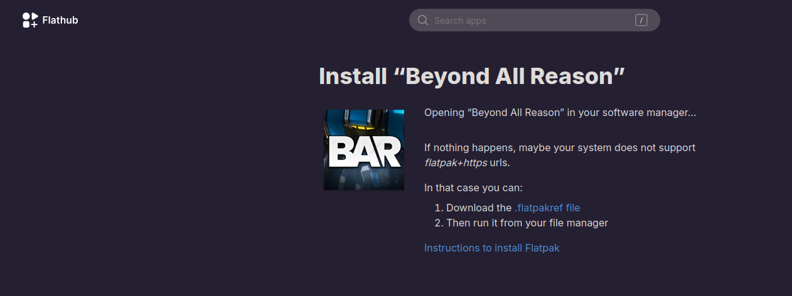
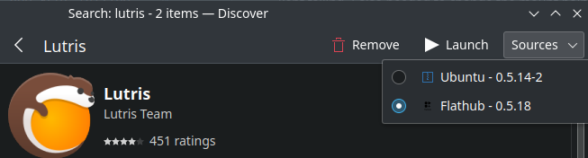

# Installing Flathub

[Flathub](https://flathub.org/) is a an Application store for Linux. You'll find a whole heap of applications on there and including some games such as [Beyond All Reason](https://www.beyondallreason.info). You can add it to your application manager (on Kubuntu this is called Discover) by following the instructions [here](https://flathub.org/setup). You'll need to follow the instructions for your Linux distribution.

# Installing Software

Once installed, you should be able to search your application manager for software contained within Flathub. However, on the odd occasion some software won't be found. If this is the case, go to [Flathub](https://flathub.org/) and search for the software you want to install. Once you click on `Install`, you'll be taken to a page that looks something like the below image.

You can click to download the .flatpakref file and once downloaded, open your file browser to wherever you downloaded the file and run it. This should then load inside your application manager and allow you to install the software as normal.

# Ensuring You Download From Flathub

Using [Lutris](https://lutris.net/) as an example, you can find this in your application manager. In Discover (this may look different in your application manager) I have the option of selecting the source of the download; Ubuntu or Flathub.

You can see that the version of Lutris on Flathub is newer than the Ubuntu provided one so in this case I will select the Flathub version to install.
You will find that whatever sources you have added to install from will appear here if there is an alternative source to install them from.