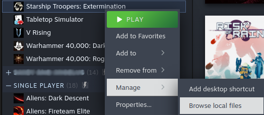

# NVIDIA Fix
## Overview
NVIDIA cards on Linux (at the time of writing) have a small issue in regards to VRAM. Essentially what should happen during a game is that when VRAM is exhausted, the game spills over into system memory so that the player doesn't notice any drops in FPS or anything else. On Linux, the reality is that the GPU simply doesn't do this and instead just stops working.

## Enter dxvk.conf
The dxvk is a layer that works directly with Direct X and Vulkan on Linux systems. You can potentially fix any issues by creating a config file in the `working directory` of your game and giving it some values that help your VRAM on your graphics card. It allows you to specify certain things like max framerate, frame latency and even VRAM. The values to enter are below:

```
dxgi.maxDeviceMemory=6684
dxgi.maxSharedMemory=1024
[<game>.exe] dxvk.maxChunkSize = 4
```

MaxDeviceMemory should be set to around 85% of your GPU's total VRAM (in my case my card has 8GB VRAM) and the maxSharedMemory should be set to around 1GB. The chunk size is set to a small number so that it uses less memory per batch of shaders and should give smoother frames. It can increase the overhead to the GPU so you may need to play with that number a bit.

Ensure the `<game>` is actually set to the name of the executable file. So for say Diablo 4 it would be set to `[Diablo IV.exe]`.

## Where To Place dxvk.conf
So the file needs to be in the working directory of your game executable. Now this is usually the same folder where the game is located (in Steam, you can right click on the game in steam):



However in some cases, the games working directory may not actually be where the physical file is located. This can sometimes be in cases where the game is launched by it's own game launcher. For instance, Battle.net seems to set the working directory for Diablo 4 to where the launcher is. For safety, I have put a dxvk.conf in both the battle.net folder AND the Diablo 4 folders.

## System Reboot
In terms of Lutris, I haven't seen the dxvk.conf take affect until I rebooted the system so I think it is probably best that when you add the dxvk.conf file reboot your system.