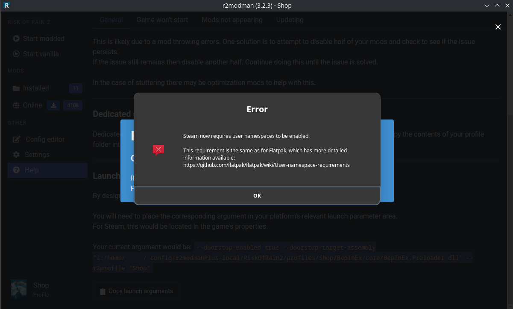
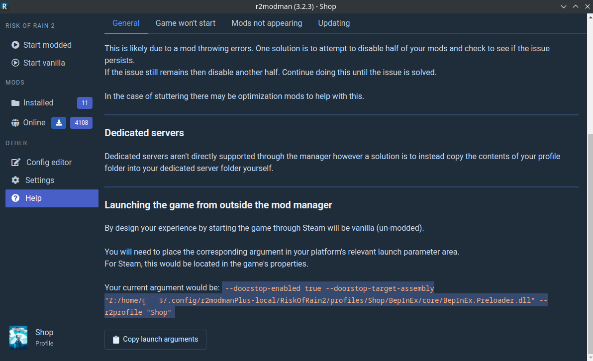
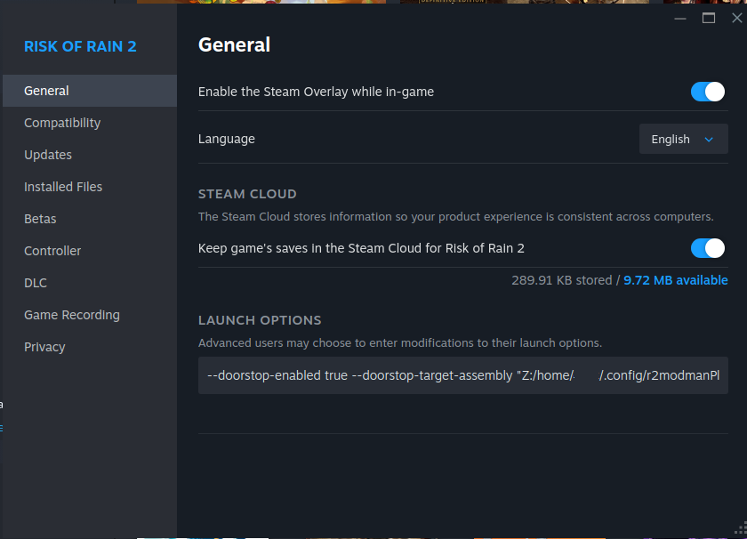

# Overview
R2modman is a popular modding client that allows you to add mods to some of your games. Typically, instead of running your game from Steam or the Epic launcher, you run r2modman with your selected profile for the game and then "Run Modded" to run your game with the selected mods.

# User Namespaces Error
Now I encountered an error when trying to launch a game (in this case Risk Of Rain 2) which states that Steam must have user namespaces enabled.
There are a good number of links about how to solve this and what kind of system edits you need to make. I wanted to avoid this so there is an alternative.

# Edit Steam / Epic Launch Commands
Once you have got all the mods you want to run installed through r2modman, go to the help menu and scroll to the bottom. This will give you a "Launching the game outside the mod manager" command to add to your games launcher. In Steam's case, you just need to go to the installed game, right click and go to properties. In the general tab there will be a textbox for your launch options. Add the copied command from r2modman there and it will now launch the game with your mods.

