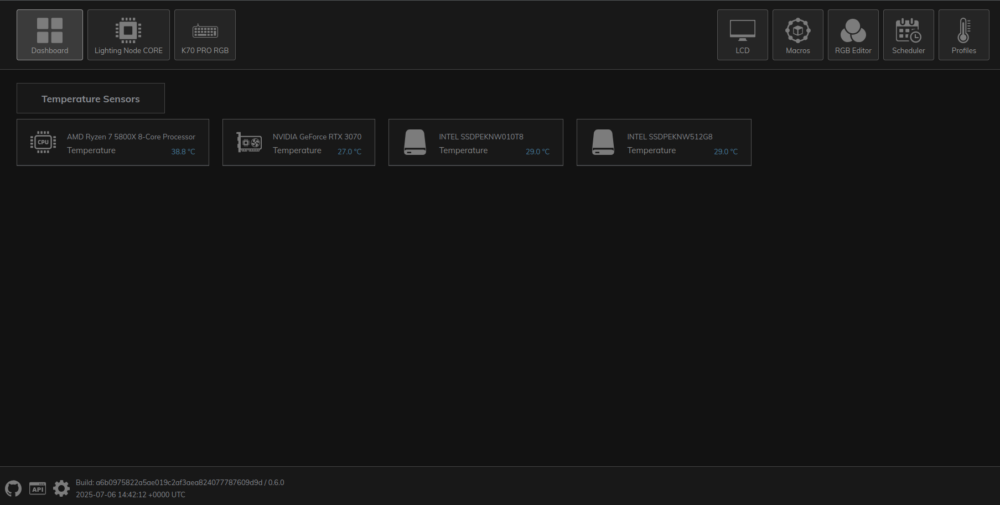

# Corsair Fans And Keyboard

{: .note-title}
> Personal Opinion
>
> The software I chose to manage my Corsair hardware is a personal choice and you should come to your own conclusion.

## Introduction

I tried a good few solutions for my RGB fans, RAM and generic RGB stuff in my machine. Don't get me wrong, it looks pretty but I really don't need it in my PC. Having said that, because I only have a single screen, the solution I eventually ended up going with allowed me to sync my RGB to my GPU temp and my CPU temp so allowed me to monitor my system without having System Monitor up.

## Options For Me
### OpenRGB

[OpenRGB](https://openrgb.org/) is an excellent choice when it comes to controlling RGB on your machine. It has a tonne of options and configurations but getting it to work exactly how you want can be a bit tricky. I used it for a good long while but as I said in the getting started, not every solution you find will be the right one.

### OpenLinkHub

[OpenLinkHub](https://openlinkhub.dev/) is an open source piece of software that allows you to control Corsair specific hardware and is geared to that manufacturer. It allowed me to link my fans to CPU and GPU temps and control the RGB on my keyboard. There is no user interface to speak of but it gives you a light web server for you to connect to and configure your system.

It is open source and support is limited so use this at your own risk.
I have been using this for a while and I find it does exactly what I need.

## Corsair K70 RGB Pro Mk 2
As an extra added bonus, the K70 keyboard (and I suspect a lot of the Corsair keyboards) have onboard profiles for RGB. So if you are looking for something _just_ for your keyboard, consider that you might just need to press the `FN` button along with a number at the top of the "QWERTY" keys and that might just do the job on its own.

## Final Words
As always do your own research. I ended up at these two options after recommendations and my own research so again, do your research.