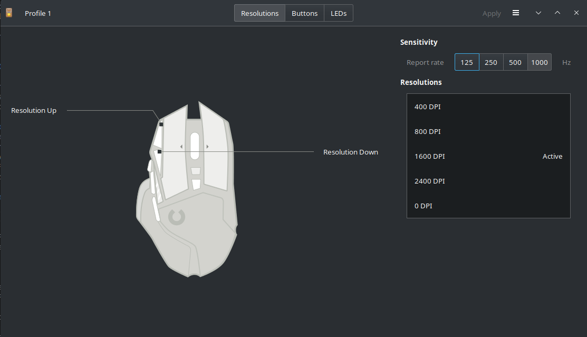

# Mouse - Logitech G502 Hero
## Overview
So it's worth saying that Logitech do not provide any software for Linux to manage the mouse or it's RGB. So we will need to rely on some third party software to allow us to configure the mouse.

## Piper

[Piper](https://github.com/libratbag/piper) is a third party software that will allow you to manage what your buttons do on the mouse. It is fairly intuitive and does exactly what you need it to do.

## Installing Piper

You can install Piper from multiple source as detailed [here](https://github.com/libratbag/piper/wiki/Installation). I chose to install it through Apt but please do choose your own source to install it from.
